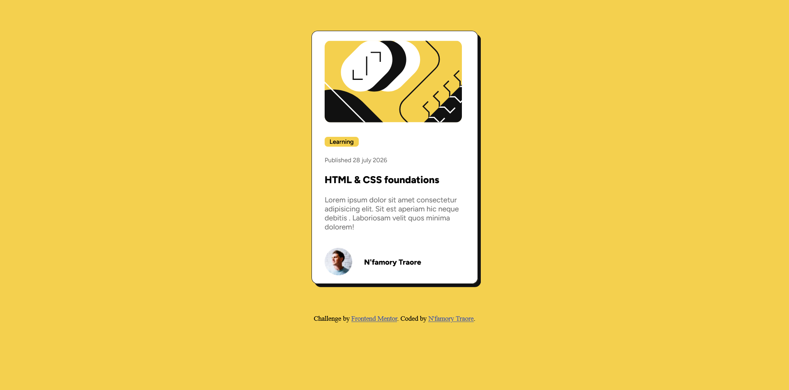
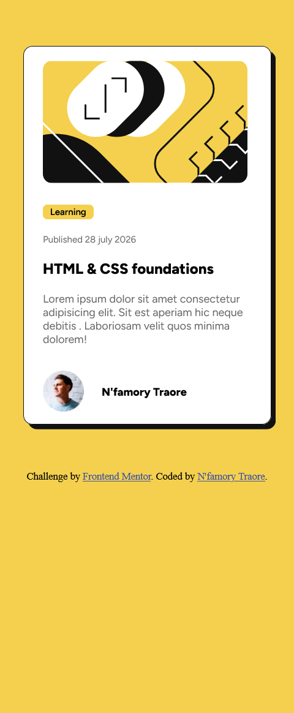

# Frontend Mentor - Solution de la carte d'aperçu d'un article de blog

Ceci est une solution au [défi Blog preview card sur Frontend Mentor](https://www.frontendmentor.io/challenges/blog-preview-card-ckPaj01IcS). Les défis Frontend Mentor vous aident à améliorer vos compétences en développement en créant des projets réalistes.

## Table des matières

* [Aperçu](#aperçu)

  * [Le défi](#le-défi)
  * [Capture d'écran](#capture-décran)
  * [Liens](#liens)
* [Mon processus](#mon-processus)

  * [Technologies utilisées](#technologies-utilisées)
  * [Ce que j'ai appris](#ce-que-jai-appris)
  * [Développement futur](#développement-futur)
  * [Ressources utiles](#ressources-utiles)
  * [Collaboration avec l'IA](#collaboration-avec-lia)
* [Auteur](#auteur)
* [Remerciements](#remerciements)

## Aperçu

### Le défi

Les utilisateurs doivent pouvoir :

* Voir les états de survol (*hover*) et de focus pour tous les éléments interactifs de la page.

### Capture d'écran

**Desktop**


**Mobile**


### Liens

* URL de la solution : [Ajoutez l'URL de votre solution ici](https://your-solution-url.com)
* URL du site en ligne : [Ajoutez l'URL de votre site en ligne ici](https://your-live-site-url.com)

## Mon processus

### Technologies utilisées

* Balisage HTML5 sémantique
* Propriétés personnalisées CSS
* Flexbox
* CSS Grid

**Remarque : Ce ne sont que des exemples. Supprimez cette note et remplacez la liste ci-dessus par les technologies que vous avez réellement utilisées.**

### Ce que j'ai appris

Utilisez cette section pour résumer certaines de vos principales découvertes et connaissances acquises pendant la réalisation de ce projet. Écrire ce que vous avez appris et ajouter des extraits de code des parties dont vous êtes fier est un excellent moyen de renforcer vos connaissances.

Pour savoir comment ajouter des extraits de code, consultez les exemples ci-dessous :

```html
<h1>Un code HTML dont je suis fier</h1>
```

```css
.proud-of-this-css {
  color: papayawhip;
}
```

```js
const proudOfThisFunc = () => {
  console.log('🎉')
}
```

Si vous avez besoin d'aide pour écrire du Markdown, nous vous recommandons de consulter [The Markdown Guide](https://www.markdownguide.org/).

**Remarque : Supprimez cette note et son contenu, puis remplacez-les par vos propres apprentissages.**

### Développement futur

Utilisez cette section pour présenter les domaines sur lesquels vous souhaitez continuer à travailler dans vos futurs projets. Il peut s'agir de concepts que vous ne maîtrisez pas encore complètement ou de techniques utiles que vous souhaitez approfondir et perfectionner.

**Remarque : Supprimez cette note et remplacez-la par vos propres objectifs de développement futur.**

### Ressources utiles

* [Ressource exemple 1](https://www.example.com) - Cette ressource m'a aidé à comprendre XYZ. J'ai particulièrement apprécié cette méthode et je compte continuer à l'utiliser à l'avenir.
* [Ressource exemple 2](https://www.example.com) - Cet article m'a beaucoup aidé à enfin comprendre ce concept. Je le recommande à toute personne qui souhaite encore approfondir ce sujet.

**Remarque : Supprimez cette note et remplacez la liste ci-dessus par les ressources qui vous ont aidé pendant la réalisation du défi. Elles pourront également vous être utiles lorsque vous reviendrez sur votre projet plus tard.**

### Collaboration avec l'IA

Décrivez comment vous avez utilisé des outils d'intelligence artificielle (si vous en avez utilisé) pendant la réalisation de ce projet. Cela permet de montrer votre capacité à travailler efficacement avec l'IA.

* Quels outils avez-vous utilisés (par exemple : ChatGPT, Claude, GitHub Copilot) ?
* Comment les avez-vous utilisés (par exemple : débogage, génération de code de base, recherche d'idées) ?
* Qu'est-ce qui a bien fonctionné ? Qu'est-ce qui n'a pas fonctionné ?

**Remarque : Supprimez cette note et son contenu si vous n'avez pas utilisé d'IA, ou remplacez-les par votre propre expérience.**

## Auteur

* Site web - [Ajoutez votre nom ici](https://www.your-site.com)
* Frontend Mentor - [@votrenomdutilisateur](https://www.frontendmentor.io/profile/yourusername)
* Twitter - [@votrenomdutilisateur](https://www.twitter.com/yourusername)

**Remarque : Supprimez cette note et ajoutez, supprimez ou modifiez les lignes ci-dessus en fonction des liens que vous souhaitez afficher.**

## Remerciements

C'est ici que vous pouvez remercier les personnes qui vous ont aidé ou inspiré. Vous pouvez également mentionner si vous avez travaillé en équipe ou si vous vous êtes inspiré d'une autre solution.

**Remarque : Supprimez cette note et modifiez cette section. Si vous avez réalisé ce défi seul, vous pouvez simplement supprimer entièrement cette section.**
